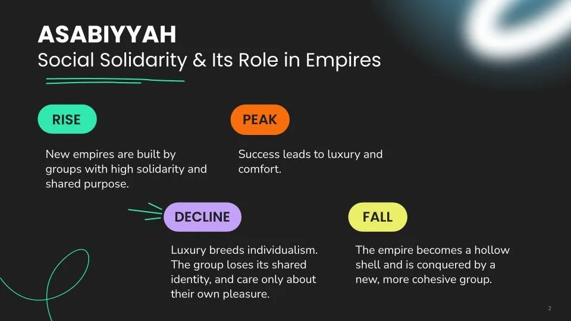

## I: Why Do Empires Collapse

Civilisation is a collective project. It's built when people with shared values and beliefs come together for a common cause. So, logically, the project fails when people no longer believe in social cohesion. Whether it's because people stopped trusting the institutions they built or because they stopped sharing an identity, empires crumble when individualism takes centre stage. People then retreat to narrow, self-interested pursuits.

The Roman Empire fell because elite landowners prioritised personal wealth over the state, evading taxes and retreated to their private villas. The military shifted toward personal loyalty to generals rather than the state. Its people chose to prioritise their own family, estate, or military unit over a corrupt, hollowed-out, and non-functional state.

The Mayan empire's rulers were focused on individual prestige, competing to build lavish monuments and perform costly rituals. They hoarded resources to maintain their elite status, destroying the social contract with the peasantry, who ultimately abandoned the cities, leading to the empire's collapse.

During the Song Dynasty, the empire was intellectually and economically vibrant, but the lack of a cohesive military strategy and the self-interest of elite bureaucrats made it vulnerable to the highly disciplined and unified Mongol forces.

The ruling elite of the Malacca Sultanate prioritised personal power and factional rivalries, while wealthy merchants assisted colonisers to protect their private property. Individual greed replaced a commitment to the common good, and left the sultanate defenceless against external threats.

Historian Ibn Khaldun provided a framework called Asabiyyah (social solidarity) explaining how this has repeatedly happened throughout history:

\

*Sounds familiar?*

## II: The Trap Of Enlightenment

The Western Enlightenment was sold as the ultimate liberation of the human mind from the shackles of superstition, religious dogma, and monarchical tyranny. Under it, we were promised universal human rights, autonomy, and progress. It shifted the focus from the collective to the self-sovereign individual. Western thinkers such as Thomas Hobbes and John Locke viewed humans as independent units that precede society. This suggests that society is just a transaction or a "contract". Adam Smith's "Invisible Hand" suggested that if everyone pursues their own selfish interests, the whole of society will benefit. Once this idea was bought, selfishness became moralised, even praised. The pursuit of private gain is now a civic virtue.

> "Modern individualism often claims to be liberation, but it quietly eats away at social connections: people chase personal projects, ambitions, and self-expression, yet frequently neglect family, community, or civic responsibilities."
> 
> — Charles Taylor, "The Ethics of Authenticity"

## III: The Corporate Engineering Of Hyper-Individualism

Have you noticed how the current world is shaped to encourage hyperindividualism? From what you watch, listen to, and consume, to the way our cities are designed, everything is curated and engineered to funnel us a 'market of one' where personal preference is the only important consideration.

We are told that we are unique and special. That we need to put ourselves first. That each individual is a centre of their own universe. Now, think back. Who are the loudest proponents of this idea? Yes, corporations and their stakeholders. They will tell you this a hundred times, a million ways, because this focus on our 'uniqueness' is exactly what makes us easier to sell to, harder to organise, and more likely to see our neighbour as a competitor rather than an ally. Corporations profit more when the collective is broken.

## IV: When "Self-Care" Becomes Complicity

Don't get me wrong. I'm not saying our individual pursuits are inherently evil. Having personal goals and caring for yourself are natural needs and desires. What's missing (but shouldn't be) is the discernment to know when "self-optimisation" becomes a form of complicity. We've been trained to view discomfort as a signal to disengage. When we witness systemic injustice or decay, the hyper-individualist script tells us to 'protect our peace.' Anytime something feels too overwhelming to process, we distract ourselves with something else. I remember when, in the face of active genocide, a popular social media page told people to switch off their phones and look away as part of self-care. This has become our culture. Discomfort has become a signal to turn away when it should be a call to act.

We need to recognise that sometimes, "focusing on yourself" is actually a script written by systems that benefit from our division. And a lot of times, "putting yourself first" can turn from self-preservation into a moral failure. True social solidarity requires us to lean into the discomfort. Let it ignite the desire to close ranks and fight back against oppression, injustice, and failures of the system. We must reclaim the ability to subordinate our private interests to the collective need. Otherwise, we will just be a collection of individuals waiting for our own turn to be disenfranchised.

At some point, the survival of our shared humanity must outweigh our personal comfort, requiring us to put ourselves second so that others might simply survive.

## V: The Radical Act Of Choosing Each Other

Hoping people will put aside their personal interests often feels like a pipe dream in a world that pays individuals to be selfish. Why should anyone choose the path of most resistance? There is no immediate profit in it, and the emotional labour of maintaining a community is, well, exhausting. Not to mention the cost of community — the loss of total autonomy — feels so high. Communal living and collective action are messy, frustrating, and often less comfortable than the curated isolation we've been living in.

But haven't you realised? Hyper-individualism hasn't made us free. It has only made us vulnerable and powerless. And if history has taught us anything, it is that the individualistic approach will lead to an impending collapse.

So what can we do? The most radical thing we can do today is not to centre ourselves in the narrative. Take action by deliberately decentralising our lives: move our resources into community-owned spaces and prioritise local interdependence over global convenience. Join a local initiative, participate in mutual aid, or commit to a shared responsibility that offers us no personal profit. At the very least, leave our bubble and connect.

After all, we don't need more special individuals; we need a people who refuse to be divided.
