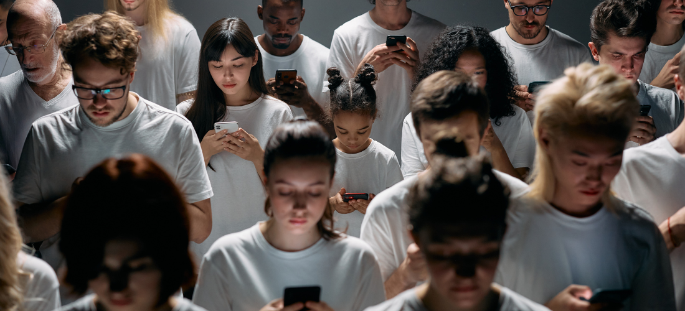

## 

## **I: The Collapse We’re Seeing**

\
For the past three years, I’d like to think that I’ve been consistent in posting and sharing about the horrors happening in the world. Sometimes I hesitate, because I fear it’d be seen as me claiming moral superiority. And sometimes I wonder, what’s the point? Everyone seems like they have other things to worry about, while I keep seeing disasters and tragedies.&nbsp;

Part of it might be the algorithm. The thing about algorithms is that they tend to distort our reality. We like a post on one topic, and all of a sudden our feeds are flooded with other posts on the same topic. After a while, we develop a certain viewpoint constructed mostly from what we scroll through.&nbsp;

Algorithms do this by design; they keep us scrolling to keep the attention economy going. They’ll even resurface posts from months ago. Old posts appear next to new ones, making it hard to tell what's current. We don’t know if things are really as bad as they look on our feeds. And we can’t completely trust the mainstream news outlets owned by the same few billionaires either. There aren’t many ways for us to verify how much of what we’re seeing is representative of reality.

And it’s not just one thing. It’s the amalgamation of everything horrible we scroll past. The ongoing genocide. The war in West Asia. The rise of fascism and ultra-nationalism. The impact of AI on resources and the environment. The unethical use of surveillance technology. Climate change and unprecedented weather disasters. It’s everything everywhere all at once.&nbsp;

Maybe my feed makes it look worse than it is. But these posts are still showing things that are actually happening to real people. Hundreds of thousands, if not millions, of people are living through these catastrophes.\

Scroll a little further, though, and it’s posts of ordinary life again, as if everything is fine.

## **II: No Room to Be Oblivious**

\
Forgive me for pointing out the disconnect. It’s just that I’ve been experiencing so much cognitive dissonance that sometimes I wonder, “Am I crazy for focusing on all of this?” But if I'm questioning my sanity for caring, can’t I also question why more of us aren't outraged?

Maybe it’s how everything is presented to us. On social media, human tragedies are flattened and given almost equal weight. After a while, images of dead children become one blurry scroll.&nbsp;

Or maybe it’s the algorithmic bubbles that trap us all. I’m in one, so others could also be in bubbles of their own. Who knows what version of the internet others are witnessing?&nbsp;

Then again, surely they’d have an inkling. The bubbles aren’t perfect. Suffering has a way of eventually seeping into our collective consciousness. In that sense, I think we’ve all lost the privilege of staying oblivious.&nbsp;&nbsp;

## **III: Our Survival Instincts**

If all of us, to an extent, *know* what’s happening, why aren’t our reactions bigger?

People (like [Ed Sheeran](https://www.fashiontimes.co.uk/ed-sheeran-macklemore-us-tour-gaza-backlash-1764012)) might want to be apolitical and not discuss these issues. It’s hard, it’s messy, and not everyone is equipped to have a conversation about them. Most people are afraid of getting it wrong, and they just don’t want to deal with the criticism.&nbsp;

But there’s no escaping events of this scale.&nbsp;

> ***"We’ve all lost the privilege of staying oblivious."***

\
Global warming and climate change are already affecting our lands and our seas, our air and our water. A war fought thousands of miles away has increased the prices of goods at home. Soon, industries could fall, and livelihoods would be lost. Suffering in one part of the world can echo across the globe and could be repeated, if not multiplied. While we might not feel the impact yet, it will affect us one day. When that day comes, there won’t be a corner for us to hide in.&nbsp;&nbsp;

Yet, the enormity of the situation is exactly the reason why so many of us continually try to minimise or ignore it. Everything seems too big to handle, to even wrap our heads around. The minute we think of the implications of everything happening, there is a real personal cost that we have to consider. Denial becomes a very helpful coping mechanism, then. Why think of all that when we can continue having vacations, going to concerts, and living our best life?

It’s also possible that many of us simply can't fathom the tentacles of suffering reaching us.

*“Sure, it’s hot now, but that’s what air conditioning is for.”*

*“My income is stable, and I have investments. How bad could things be?”*

*“The war will never reach here. Our country is so peaceful!”*

Could these be what’s running in some people’s heads? I can’t say for sure.

The more cynical take is that there are people who know what's happening, know what's driving it, and still decide to side with the system. But not in the villainous way you’re thinking of.&nbsp;

In a world where corporations and colonisers are actively trying to extract as much of our value as possible (and slowly killing us in the process), some people might find it easier to pledge fealty to our capitalist overlords. Perhaps their survival instincts are pushing them to find more ways to show loyalty to people at the top, in the hope that they won’t be lumped in with the rest of us plebeians. So they consume, they revel, and, whether they mean to or not, they make the rest of us feel like the crazy ones.

## **IV: We’re All Just… Tired**

On the other hand, there is a kinder reading of what some might label as apathy.&nbsp;

What we're going through collectively is not normal. [The planet has never warmed this fast in recorded history](https://time.com/7382950/climate-change-speeding-up-science/), and never has an entire civilisation watched it happen live. Genocides being livestreamed, documented by the people living through them, and delivered to our palms 24/7. Imagine telling someone 50 years ago that they'd carry every catastrophe in the world in their pocket. They'd probably ask, “Why would I subject myself to that?”

Our brains simply aren’t built to process multiple concurrent global catastrophes in real time. In fact, the more people die, the less we care [due to psychic numbing](https://www.cambridge.org/core/books/abs/behavioural-public-policy/more-who-die-the-less-we-care-psychic-numbing-and-genocide/5C41D141244217E7E1CA4D37783E1AEF). As numbers get larger, they fail to trigger the emotion or feeling necessary to motivate action.

In the same 20 seconds, we’re supposed to pay attention to a genocide, a flood, an election, someone's breakup, and a new skincare launch. We're expected to remain informed, be politically conscious and socially aware, stay environmentally responsible, *and* be emotionally available. All this while also going to work, paying rent, maintaining relationships, exercising, looking after ourselves and actually living life? How are our brains going to process scale, geography, chronology and personal relevance that’s collapsed into one continuous stream?&nbsp;

**We just don’t have the capacity to handle all of that.**&nbsp;

Even when we do have the energy, some of us might not know what actions are useful. After all, we post, protest, argue, donate, and boycott, but change drips slowly. After a while, resistance can feel futile, and the inertia can be debilitating.&nbsp;

That could also be another tool of the system. While it drops bombs in one part of the world, it bombards another part with so much information that it drains us spiritually and physically.&nbsp;

When exhaustion takes over, some of us simply give up. And you know what? Surrender sure looks a lot like indifference.&nbsp;

## **V: A Way Forward**

I wrote [another post similar to this](https://www.indrairwan.com/blog/two-years-of-suffering) about a year ago. To be honest, the post back then was laced with outrage at the lack of other people’s outrage. While I’d like to say I have outgrown that sentiment, I have to admit there is still a tinge of bitterness.&nbsp;

What’s changed is that I have come to accept that anger is not the only yardstick for caring. Some people are privately grieving. Some are financially or physically constrained. They might even be doing the work of resistance away from phone screens.&nbsp;

In any case, I am not interested in judging who cares more and who doesn’t care enough. Everyone is free to choose their path. I am more interested in people who want to do more, but are feeling the emotional burden of caring too much.&nbsp;

Isn’t that ironic? We care because we don’t want others to suffer, but caring can also make us feel that others’ suffering is ours to carry.

**It isn’t.**

There is only so much of ourselves to go around, and there are always more and more things that require our attention. So, we should pace ourselves and start caring sustainably. Yes, “caring sustainably” sounds like one of those silly corporate buzzwords, but I think it aptly captures what we need to do to last the distance.&nbsp;

Caring sustainably means grounding ourselves first. That might look like taking a few slow breaths before opening an app, or putting the phone down. It can be in the form of a prayer, journaling, or a long walk. Whatever form it takes, the point is to remind ourselves that we’re still here and still able to act. That we can't help anyone if we're drowning.

Once we've found our footing, it gets easier to see that the feed doesn't have to run us. We can follow fewer, better sources, and mute those that leave us perpetually spiralling. We don’t look away, but we choose how we look.

We must also accept that no one can carry every tragedy at once. Instead, we can pick one or two causes to focus on. Learn the history, listen to the people on the ground, and keep showing up.&nbsp;

> ***"Our effort has to last longer than our outrage."***

A lot of that showing up can happen through mutual aid, community groups, or just talking to the people around us. These connections will matter when things get harder closer to home. These are the people we'll lean on. We don't have to start a revolution on our own. We can support people already doing the work and contribute where we can. It makes the work feel less lonely, while also making it easier to keep going. Change is slow, so our effort has to last longer than our outrage.

That's also why rest matters. It’s okay to step away and then come back. Going to concerts and enjoying a holiday doesn’t have to mean we’ve stopped caring. We can still enjoy these things, as long as we're doing it to recharge, not to escape. Because when we’re tired and left empty, we become easier to manipulate, easier to distract, and less capable of doing anything meaningful at all. Take a break when it’s needed. Just don't forget to return.

Obviously, we can’t afford to become oblivious. But neither can we afford to become so overwhelmed by everything going on that we lose our capacity to respond to it; that we sink into mindless consumption to distract ourselves, or withdraw completely because we no longer know what else to do. And that's exactly what the attention economy is counting on.

I don't think I'm crazy for caring about all of this. And if you've been carrying these same thoughts, I don't think you are either. You're paying attention, and that's where it starts.
